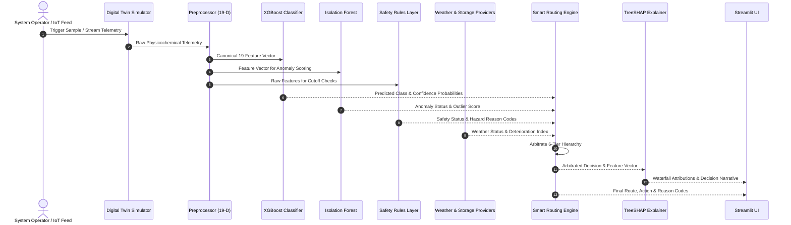

# Final System Architecture Specification
## AI-Driven Intelligent Greywater Management and Smart Reuse Routing System

---

### Conceptual Architecture Diagram

```
                 Greywater Sources
      (Bathroom, Laundry, Kitchen, Mixed Composite)
                        │
                        ▼
                Water Quality Data
  (pH, Turbidity, TSS, TDS, BOD, COD, DO, E. coli, etc.)
                        │
                        ▼
              Digital Twin / Live Input
   (Stochastic Telemetry Simulator or Physical Sensors)
                        │
                        ▼
               Preprocessing Engine
       (One-Hot Encoding, Feature Alignment, 19-D)
                        │
                        ▼
      ┌────────────────────────────────────┐
      │      XGBoost / Random Forest       │
      │   Multiclass Routing Predictor     │
      └────────────────────────────────────┘
                        │
                        ▼
           Isolation Forest Screening
       (Unsupervised Outlier Detection)
                        │
                        ▼
             Independent Safety Layer
     (Strict Deterministic Hazard Thresholds)
                        │
                        ▼
           Weather Context Provider
    (Open-Meteo API / Local Meteo Cache)
                        │
                        ▼
        Storage & Biochemical Decay Monitor
     (Hydraulic Tank Tracking & Arrhenius Decay)
                        │
                        ▼
           Central Smart Routing Engine
       (6-Tier Priority Arbitration Logic)
                        │
                        ▼
      ┌────────────────────────────────────┐
      │        Final Route + Action        │
      │         Reason Audit Codes         │
      └────────────────────────────────────┘
                        │
                        ▼
             TreeSHAP Explainability
     (Local & Global Feature Attributions)
                        │
                        ▼
         Streamlit Interactive Dashboard
      (10 Specialized Operator & Viva Views)
```

---

### End-to-End Component Breakdown

#### 1. Greywater Source & Water Quality Data Layer
* **Module Path:** `dataset/main.csv`, `dataset/processed/`
* **Description:** Represents greywater generated across distinct residential domestic fixtures (Bathroom shower/sink, Laundry washing machine, Kitchen sink, and Mixed composite streams).
* **Parameters Tracked (14 Physicochemical & Biological Metrics):**
  * *Physical:* `pH`, Temperature (`TEMP_C`), Salinity (`SAL_ppt`), Turbidity (`TUR_NTU`), Dissolved Solids (`DS_mg_L`), Total Dissolved Solids (`TDS_mg_L`), Total Suspended Solids (`TSS_mg_L`), Electrical Conductivity (`COND_uS_cm`).
  * *Chemical:* Dissolved Oxygen (`DO_mg_L`), Biochemical Oxygen Demand (`BOD_mg_L`), Chemical Oxygen Demand (`COD_mg_L`), Ammonium Fluoride (`NH4F_mg_L`), Nitrate (`NO3_mg_L`), Potassium (`K_mg_L`).
  * *Microbiological:* *Escherichia coli* concentration (`E_coli_CFU_100mL`).

#### 2. Digital Twin Telemetry Simulation Layer
* **Module Path:** `simulation/` (`digital_twin.py`, `greywater_simulator.py`, `telemetry_generator.py`)
* **Description:** Provides a virtual representation of greywater generation dynamics. It generates continuous time-series telemetry with realistic diurnal flow variations, thermal dissipation, stochastic noise, and source profile transitions.
* **Outputs:** 15-minute resolution telemetry feeds consumed directly by downstream inference pipelines.

#### 3. Preprocessing & Feature Engineering Layer
* **Module Path:** `preprocessing/`, `models/preprocessor.pkl`
* **Description:** Formats raw heterogeneous dictionary payloads, CSV rows, or simulated telemetry into canonical 19-dimensional model-aligned vectors:
  $$\text{Vector} = [\text{Bathroom}, \text{Kitchen}, \text{Laundry}, \text{Mixed}, \text{pH}, \text{TEMP\_C}, \dots, \text{E\_coli\_CFU\_100mL}]$$
* **Validation:** Enforces strict non-negativity constraints, type safety, missing-column detection, and schema validation.

#### 4. Primary & Comparison Supervised ML Models
* **Module Path:** `models/` (`xgboost_optimized.pkl`, `random_forest_optimized.pkl`)
* **Target Classes (4 Operational Reuse Routes):**
  * `0`: **Sewer Bypass** (High risk, heavily contaminated, or untreatable greywater)
  * `1`: **Bio-filtration** (Moderate organic/surfactant load requiring bio-retention/sand filtration)
  * `2`: **Restricted Irrigation** (Low pathogen/solids load suitable for landscape/drip irrigation)
  * `3`: **Indoor Reuse** (High-quality tertiary-grade water for toilet flushing and sub-surface utility)
* **Performance:** Optimized XGBoost achieves 97.78% test accuracy, 0.7346 Macro F1, 0.9756 Weighted F1, and 0.9701 Sewer Bypass recall.

#### 5. Anomaly Detection & Statistical Screening Layer
* **Module Path:** `anomaly/` (`anomaly_detector.py`, `models/isolation_forest.pkl`)
* **Description:** Unsupervised Isolation Forest trained on clean baseline water-quality distributions ($5\%$ contamination rate).
* **Key Design Principle:** An anomaly indicates statistical novelty relative to training observations. **An anomaly alone does NOT force Sewer Bypass.** It flags the observation as `ANOMALY_REVIEW` while preserving the candidate reuse route, preventing unnecessary diversion of clean water.

#### 6. Independent Water-Quality Safety Layer
* **Module Path:** `routing/safety_rules.py`
* **Description:** Hardcoded, deterministic engineering safety boundaries that cannot be learned away or compromised by ML probability shifts.
* **Safety Rules:**
  * Acidic breach ($pH < 6.0$) or Alkaline breach ($pH > 9.0$) $\rightarrow$ `CRITICAL` $\rightarrow$ Sewer Bypass.
  * Acute pathogen spike ($E. coli > 50,000 \text{ CFU}/100\text{mL}$) $\rightarrow$ `CRITICAL` $\rightarrow$ Sewer Bypass.
  * Organic overloading ($BOD > 200 \text{ mg/L}$ or $COD > 400 \text{ mg/L}$) $\rightarrow$ `CRITICAL` $\rightarrow$ Sewer Bypass.
  * Excessive salinity / mineral conductivity ($TDS > 1000 \text{ mg/L}$) $\rightarrow$ `HIGH_RISK` $\rightarrow$ Sewer Bypass.
* **Precedence:** Safety evaluations hold absolute precedence over ML predictions, weather, and storage state.

#### 7. Environmental & Weather Context Layer
* **Module Path:** `context/` (`weather_provider.py`, `weather_client.py`, `weather_cache.py`, `context_rules.py`)
* **Description:** Integrates meteorological context via Open-Meteo REST API with an in-memory TTL cache ($30\text{ min}$) and seasonal fallback tables.
* **Arbitration:** Rain events ($> 5.0\text{ mm}$ or precip prob $> 70\%$) or freezing conditions preclude outdoor irrigation to prevent runoff. The candidate route (`Restricted Irrigation`) is retained, but the action is deferred to `STORE_FOR_LATER`.

#### 8. Storage Tank & Biochemical Decay Monitoring Layer
* **Module Path:** `storage/` (`storage_manager.py`, `shelf_life_estimator.py`, `water_decay_model.py`, `storage_rules.py`)
* **Description:** Dynamically tracks physical tank volume ($1000\text{ L}$ capacity), inflow/outflow balance, and biochemical deterioration.
* **Decay Formulation:** Mechanistic Arrhenius-style model tracking dissolved oxygen depletion and microbial proliferation over hydraulic residence time. If deterioration index exceeds $0.70$ or storage age exceeds shelf-life ($24-48\text{ h}$), the action is escalated to `REVIEW_REQUIRED` or `RECIRCULATE`.

#### 9. Central Smart Routing Engine
* **Module Path:** `routing/` (`routing_engine.py`, `inference_pipeline.py`, `decision_schema.py`, `reason_codes.py`)
* **Description:** Synthesizes inputs from all preceding layers via a deterministic 6-tier hierarchical arbitration priority:
  1. **Tier 1:** Physical Safety Override (Critical water-quality hazards $\rightarrow$ Sewer Bypass).
  2. **Tier 2:** ML Inference Confidence & Class Mapping.
  3. **Tier 3:** Anomaly Advisory Review (Non-forcing statistical flag).
  4. **Tier 4:** Storage Tank Deterioration Review (Biochemical stagnation).
  5. **Tier 5:** Weather / Environmental Preclusion (Rainfall deferral).
  6. **Tier 6:** Nominal Operational Approval (`ALLOW_ROUTE`).
* **Output:** Structured `FinalDecisionOutput` containing final route, final action, audit reason codes, and override flags.

#### 10. TreeSHAP Explainability Layer
* **Module Path:** `explainability/` (`shap_explainer.py`, `local_explainer.py`, `global_explainer.py`, `decision_explainer.py`)
* **Description:** Provides local instance-level attribution and global feature ranking for the multi-class XGBoost model.
* **Resilience:** Implements graceful fallback to `"SHAP_UNAVAILABLE"` if SHAP calculations fail or dependencies are omitted, ensuring explainability never breaks the central routing pipeline.
* **Disclaimer:** Explains mathematical model behavior, not causal biological reality.

#### 11. Streamlit Interactive Dashboard
* **Module Path:** `dashboard/` (`app.py`, `components/`, `services/`, `styles/`)
* **Description:** Multi-page production UI with 10 dedicated sections:
  1. *Executive Dashboard:* System KPIs, state gauges, quick action buttons.
  2. *Live Monitoring:* Real-time streaming charts from Digital Twin telemetry.
  3. *Water Quality:* Parameter distributions, laboratory radar comparisons, threshold flags.
  4. *Smart Routing:* Interactive single-sample decision engine and batch CSV upload.
  5. *Storage Tank:* Tank level gauge, volume inflow/outflow, shelf-life deterioration tracker.
  6. *Weather:* Meteorological forecasts, precipitation probability, outdoor reuse advisories.
  7. *Anomaly Detection:* Isolation Forest scatter projection, outlier flags, anomaly scores.
  8. *AI Explainability:* Interactive TreeSHAP waterfall charts, summary bar plots, feature impact tables.
  9. *Reports:* Downloadable system audit, model validation logs, CSV export.
  10. *System Information:* Pipeline architecture topology, model checksums, software environment.

---

### Data Flow & Communication Topology



---

### Software & Hardware Requirements

* **Python Version:** 3.10+ (Tested on Python 3.14 x64 on Windows 11)
* **Core Libraries:** `xgboost>=1.7.0`, `scikit-learn>=1.2.0`, `shap>=0.41.0`, `streamlit>=1.28.0`, `pandas>=1.5.0`, `numpy>=1.23.0`, `matplotlib>=3.6.0`, `plotly>=5.18.0`, `requests>=2.28.0`, `pytest>=7.0.0`
* **Model Storage Format:** Serialized `.pkl` artifacts via `joblib`.
* **Execution Footprint:** Lightweight CPU inference (~15ms per sample, ~45ms with SHAP calculations).
